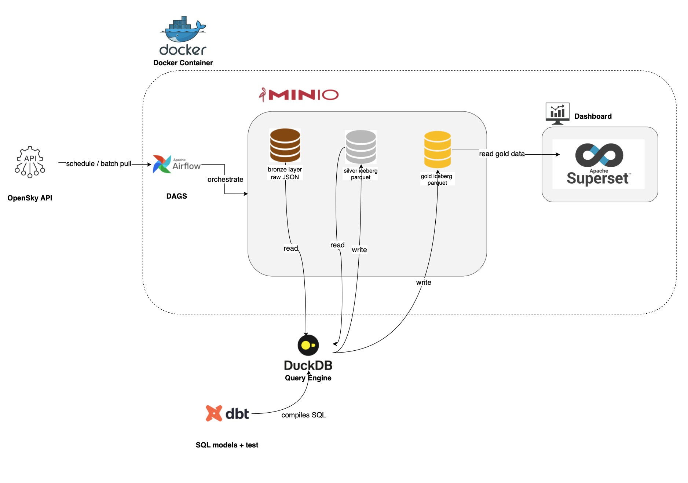
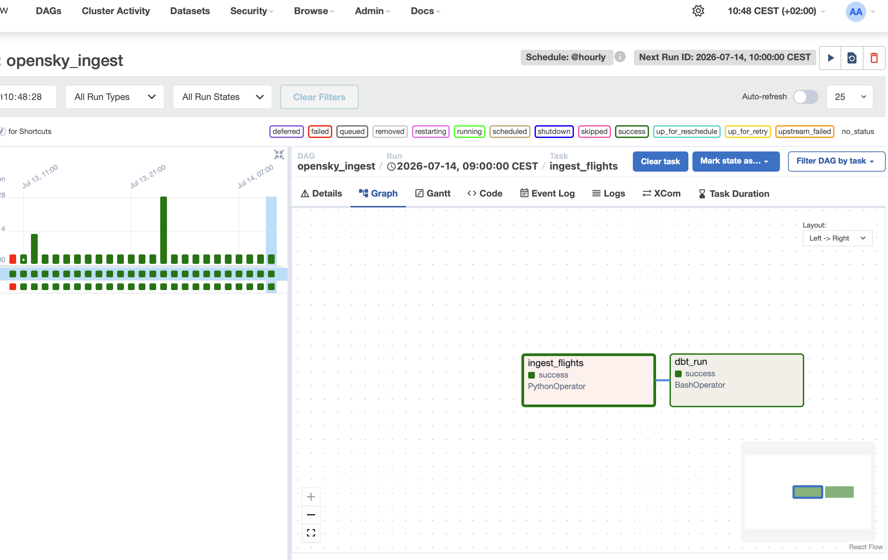
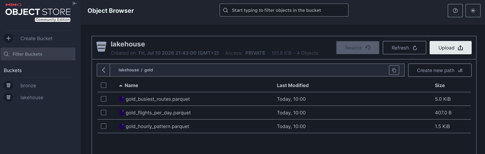
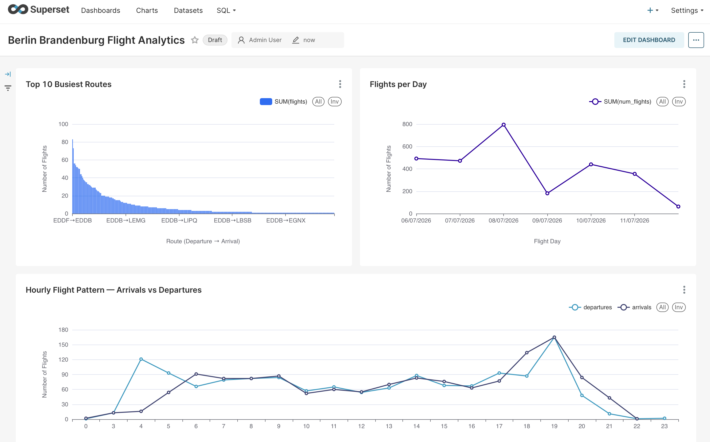

# flightdeck-platform

E2E flight data platform: ingests live flight data from OpenSky API into a MinIO lakehouse, transforms it through bronze/silver/gold layers with dbt + DuckDB (Parquet), and visualize it in Superset.
Orchestration is done via Airflow and all running on Docker.

To access the opensky endpoints, you need a client id and client secret, which are only available after creating an account.
OpenSky docs: https://openskynetwork.github.io/opensky-api/

dbt was moved into a docker container. Because of this, testing the connection to duckdb (data retrieval and transformation) requires different ports when running locally vs. images from the container.
.env.local.testing was provided in the root directory, an example of the environment variables is also provided, along with a file for connecting and running queries (/duckdb/test_duckdb_local_connection.py)

Due to limitations in the DuckDB Iceberg extension around update/rebuild operations, silver and gold are materialized as Parquet files that are fully rebuilt from bronze on each dbt run.
Link to the limitations: https://duckdb.org/2025/11/28/iceberg-writes-in-duckdb

## Getting Started
1. Create an .env file in the root directory (see .env.example for the required environment variables)
2. Install docker desktop 
3. Start the whole stack
```
docker compose up -d
```
4. Wait for the services to become healthy, then access:
- Airflow: http://localhost:8000
- MinIo Consol: http://localhost:9001
- Superset: http://localhost8088

5. In Airflow, enable and trigger the DAG (opensky_ingest). This ingests data into the bronze layer and runs dbt to build the silver & gold layer
6. In Superset, the dashboard reads the gold layer from MinIo

## Architecture



## Airflow DAG


## MinIO


## Dashboard on Superset (Berlin Brandenburg Flight Analytics)


